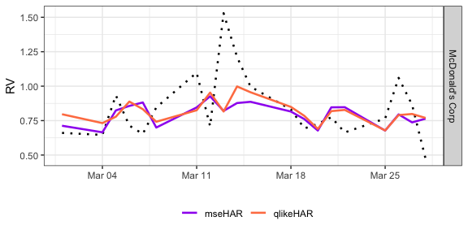

# Replication package for “Coherent Forecasting of Realized Volatility”

## Citation

M. Puke and K. Schweikert (2025). Coherent Forecasting of Realized
Volatility. *Preprint* available from *SSRN*.

## Overview

The code in this replication material generates figures presented in the
aforementioned paper “Coherent Forecasting of Realized Volatility”.

The main contents of the repository are the following:

- `00_functions/`: folder that holds functions for the qlikeHAR
- `01_simulations/`: folder with simulation material
- `02_data/`: folder containing the data and code for data cleaning
- `03_application/`: folder with replication material for the
  application

## Data

We use data from the CAPIRE library which is a collection of realized
quantities referring to the Dow Jones Industrial Average Index
constituents (<https://datarepository.stat.unipd.it/item/49>). The data
was made available for teaching and research purposes by the Università
degli Studi di Padova.

## References

Università degli Studi di Padova. Dipartimento di Scienze Statistiche
(2025). Data Repository.
<https://doi.org/10.25430/DATAREPOSITORY-STATISTICALSCIENCES>.

